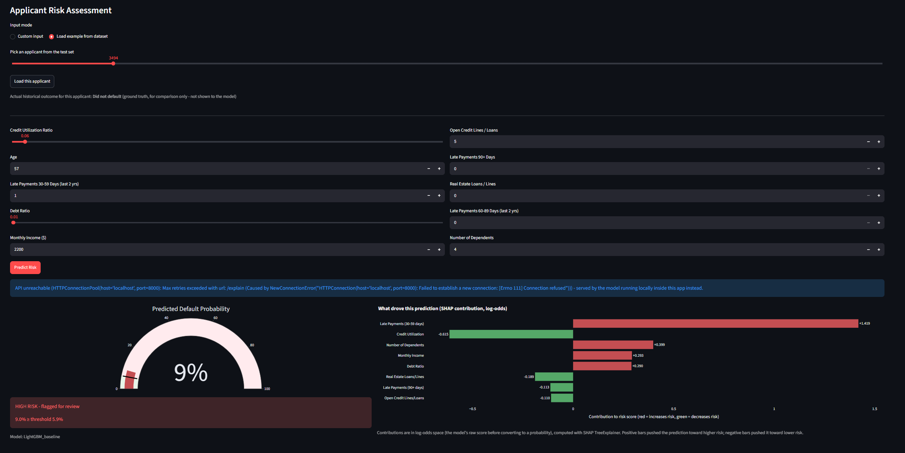
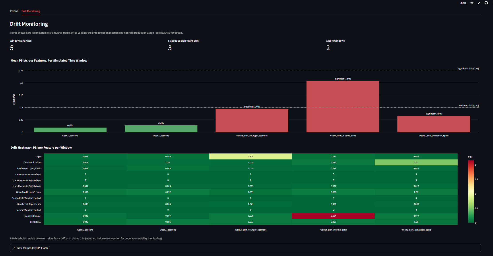

# Credit Risk Prediction API with Live Drift Monitoring

Predicts whether a loan applicant will default within 2 years, served as a production-style REST API with a live monitoring layer that flags when incoming data starts diverging from the training distribution.

**Live Demo :** [Deployment](https://credit-risk-prediction-drift-monitoring-jaideep190.streamlit.app/)




## Problem Statement

A trained model and a live API are only part of the job. In production, model performance degrades as real-world data drifts from the training distribution, often without any visible signal. This project predicts credit default risk and monitors for that drift using the Population Stability Index (PSI), a standard technique in MLOps and credit risk practice.

## Key Design Choices

- **Leak-free preprocessing**: Imputation medians and outlier caps are computed from the train split only. All thresholds are derived from raw-data percentiles rather than fixed conventions.
- **Threshold selection**: The deployed decision threshold is chosen via Youden's J statistic on the ROC curve, with the full precision/recall trade-off reported.
- **Drift monitoring**: PSI is computed per feature per time window and validated against deliberately shifted simulated traffic to confirm it distinguishes real drift from noise.
- **Explainability**: Per-prediction SHAP contributions are framed for adverse action reasoning, as required in credit risk, rather than as a general business-impact summary.

## Dataset

[Kaggle "Give Me Some Credit"](https://www.kaggle.com/c/GiveMeSomeCredit) - 150,000 applicants, 10 features (utilization, age, payment history, income, credit lines), binary target `SeriousDlqin2yrs`. Default rate: **6.68%** (imbalanced).

## Raw EDA - What Drove Every Preprocessing Decision

| Finding | Decision |
|---|---|
| `MonthlyIncome` missing 19.82%, `NumberOfDependents` missing 2.62% | Explicit `_was_missing` flag columns + median imputation |
| 1 row with `age == 0` | Dropped (impossible value, not imputable) |
| `RevolvingUtilizationOfUnsecuredLines`: 99.5th pct = 1.37, but 99.9th pct = 1571 | Capped at 99.5th percentile - the 99.9th tail is dominated by a handful of broken values |
| `DebtRatio` median 0.37 vs. rows with `MonthlyIncome == 0` having median DebtRatio **930** | Confirms the extreme tail is a division-by-near-zero artifact, not real debt burden. Capped at 99th percentile |
| Delinquency columns: sentinel codes 96/98 (269 rows, same rows across all 3 columns) | One corrupted data batch, not independent errors. Capped at each column's true observed max (13 / 11 / 17) |


Strongest linear correlations with default: `NumberOfTime30-59DaysPastDueNotWorse` (0.126), `NumberOfTimes90DaysLate` (0.117), `age` (-0.115). `DebtRatio` and `RevolvingUtilizationOfUnsecuredLines` show near-zero linear correlation - expected, since their signal is nonlinear and their raw values are dominated by outlier noise.

## Preprocessing Pipeline

1. Drop `age == 0` row (fixed rule, applied before split - not a leakage risk)
2. **Train/test split (80/20, stratified) happens before any statistic is computed**
3. Fit medians, percentile caps, and delinquency caps on the **train split only**
4. Apply identically to train, test, and every live API request (via a shared `common/preprocessing.py` module - single source of truth, no train/serve skew)

## Model Training & Comparison

10 models trained: Logistic Regression, Random Forest, XGBoost, LightGBM - each with an unweighted baseline plus class-imbalance variant(s) (`class_weight='balanced'` and/or `scale_pos_weight`).

| Model | Accuracy | Precision | Recall | F1 | ROC AUC |
|---|---|---|---|---|---|
| **LightGBM_baseline** | 0.9353 | 0.5443 | 0.1960 | 0.2882 | **0.8646** |
| LightGBM_scale_pos_weight | 0.8212 | 0.2341 | 0.7377 | 0.3554 | 0.8620 |
| LightGBM_class_weight_balanced | 0.8224 | 0.2342 | 0.7297 | 0.3545 | 0.8604 |
| LogisticRegression_balanced | 0.8007 | 0.2159 | 0.7536 | 0.3357 | 0.8589 |
| RandomForest_baseline | 0.9352 | 0.5447 | 0.1855 | 0.2768 | 0.8502 |
| RandomForest_balanced | 0.9256 | 0.4328 | 0.3661 | 0.3966 | 0.8467 |
| LogisticRegression_baseline | 0.9354 | 0.6143 | 0.0898 | 0.1567 | 0.8437 |
| XGBoost_baseline | 0.9339 | 0.5137 | 0.2155 | 0.3036 | 0.8435 |
| XGBoost_balanced_sample_weight | 0.8518 | 0.2505 | 0.6110 | 0.3553 | 0.8299 |
| XGBoost_scale_pos_weight | 0.8553 | 0.2519 | 0.5910 | 0.3532 | 0.8230 |

*(all metrics at the default 0.5 threshold, on the held-out test set)*

**Winner: LightGBM_baseline (AUC 0.8646)** - ROC AUC, not accuracy, is the deciding metric here since it's threshold-independent and unaffected by the 6.68% class imbalance. Notably, class weighting *slightly reduced* AUC for every tree-based model - it doesn't improve ranking quality, it only shifts the decision boundary. XGBoost underperformed every other family here (~0.82-0.84 AUC) at default hyperparameters; not tuned further, out of scope for this project.

## Threshold Tuning

| Strategy | Threshold | Accuracy | Precision | Recall | Specificity | F1 |
|---|---|---|---|---|---|---|
| Default | 0.500 | 0.935 | 0.544 | 0.196 | 0.988 | 0.288 |
| **Youden's J (selected)** | **0.059** | **0.785** | **0.208** | **0.791** | 0.785 | 0.330 |
| F1-optimal | 0.223 | 0.919 | 0.408 | 0.483 | 0.950 | 0.442 |

**Selected: Youden's J.** In credit risk, missing a real defaulter (bad debt) typically costs more than an extra manual review on a good applicant, so a recall-heavy operating point is the standard default absent specific cost data. At this threshold, the API catches **79% of actual defaulters**, at the cost of a low 21% precision - stated plainly, not hidden: **roughly 4 out of every 5 applicants flagged as high-risk would not have actually defaulted.**

F1 stays capped in the 0.3-0.44 range across every threshold - this is a structural consequence of the 6.68% base rate, not a weak model. ROC AUC (0.8646) is the honest headline number.


## Explainability

The `/explain` endpoint returns per-applicant SHAP contributions (`shap.TreeExplainer`, exact for tree ensembles) alongside the prediction - the kind of adverse-action reasoning credit decisions are typically expected to provide, not a general business-impact tool. Values are in log-odds space (SHAP's native output for tree classifiers): positive contributions push risk up, negative push it down. Visualized as a bar chart in the Streamlit dashboard for every prediction.

## Drift Monitoring

**Methodology**: PSI is computed on model-ready features (post-imputation, post-capping) - comparing what the model actually sees, not raw values. Reference distribution is `data/processed/train.csv`. Incoming data is passed through the identical `apply_preprocessing()` transform before comparison.

**Note on traffic**: since this API has no real production users, traffic is simulated (`src/simulate_traffic.py`) across 5 labeled windows - 2 baseline (sampled from the held-out test set) and 3 deliberately shifted (younger applicant segment, income shock, utilization spike) - to validate that the detector correctly stays quiet on stable data and correctly isolates real drift.

| Window | Mean PSI | Max PSI | Severity |
|---|---|---|---|
| week1_baseline | 0.019 | 0.069 | stable |
| week2_baseline | 0.028 | 0.095 | stable |
| week3_drift_younger_segment | 0.095 | 0.874 (age) | significant_drift |
| week4_drift_income_drop | 0.208 | 2.154 (MonthlyIncome) | significant_drift |
| week5_drift_utilization_spike | 0.066 | 0.510 (utilization) | significant_drift |

Both baseline windows stayed stable on every one of 12 features. Each drifted window flagged **only the specific feature that was actually shifted** - e.g. `week3` fired on `age` alone (PSI 0.874) while every other feature stayed stable - confirming the detector discriminates real drift rather than firing on noise.


PSI thresholds (standard convention): `< 0.10` stable, `0.10-0.25` moderate drift, `>= 0.25` significant drift.

## Architecture

```
FastAPI (/predict, /explain, /health)
    -> loads champion model + preprocessing artifacts + decision threshold at startup
    -> logs every request to logs/requests.jsonl
    -> shared common/preprocessing.py used identically by training and serving

Streamlit dashboard
    -> Predict tab: custom input or load a real test-set example, live risk gauge + SHAP chart
    -> Drift Monitoring tab: PSI heatmap + trend chart, reads drift_report.json
```

## Tech Stack

Python, Pandas, Scikit-learn, XGBoost, LightGBM, SHAP, FastAPI, Streamlit, Plotly

## Running Locally

```bash
pip install -r requirements.txt

# Full pipeline (only needed once, or after changing data/preprocessing)
python src/eda_raw.py --input data/raw/cs-training.csv
python src/preprocess.py --input data/raw/cs-training.csv
python src/train.py
python src/evaluate.py

# Serve
uvicorn app.main:app --reload          # http://localhost:8000/docs
streamlit run dashboard/app.py         # http://localhost:8501

# Drift monitoring demo
python src/simulate_traffic.py --api-url http://localhost:8000
python src/drift_monitor.py
```

